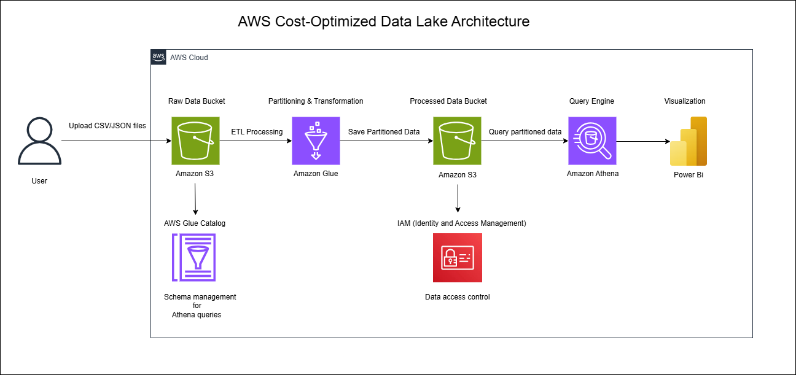

# AWS Cost-Optimized Data Lake for Financial Data Processing and Analysis

## 📊 **1. Project Title:**
**AWS Cost-Optimized Data Lake for Financial Data Processing and Analysis**

---

## 💡 **2. Project Objective**
✅ **Purpose:**
The objective of this project is to process and analyze financial data using AWS services in a cost-optimized manner.
- Execute **ETL processing, partition financial data, run queries, and visualize insights**.
- Build a **scalable, efficient, and cost-effective** data lake architecture on AWS.

✅ **Why AWS Cost-Optimization?**
- **Partitioned data** improves query performance and reduces costs.
- **Serverless services** (Glue, Athena) eliminate infrastructure management overhead.
- **Pay-as-you-go model** ensures cost-efficiency by charging only for actual usage.

---

## 🛠️ **3. Technologies Used**
- **AWS S3:**
   - Stores raw and processed data efficiently.
   - Supports partitioned storage for optimized queries.

- **AWS Glue:**
   - ETL pipeline for **data transformation, cleaning, and partitioning**.
   - Saves partitioned data to the **processed S3 bucket**.

- **AWS Glue Data Catalog:**
   - Schema management and metadata creation.
   - Reference catalog for Athena queries.

- **Amazon Athena:**
   - **Serverless SQL engine** to query data stored in S3.
   - Optimized performance and reduced costs using partitioned data.

- **AWS IAM (Identity and Access Management):**
   - **Access control** for data lake resources.
   - Ensures secure data access.

- **Power BI:**
   - Interactive dashboards for financial data visualization.
   - Displays **financial insights** using Power BI charts and graphs.

---

## 📊 **4. Architecture Diagram**

---

## 📊 **5. Data Model**
### **Table: `financial_transactions`**
| **Column Name**      | **Data Type**    | **Description**                 |
|----------------------|-----------------|---------------------------------|
| `transaction_id`     | STRING          | Unique ID for each transaction  |
| `user_id`           | STRING          | ID of the user                  |
| `amount`            | FLOAT           | Transaction amount              |
| `transaction_type`  | STRING          | Type of transaction (debit/credit) |
| `timestamp`         | TIMESTAMP       | Time of transaction             |

### **Sample Data**
| transaction_id | user_id | amount  | transaction_type | timestamp          |
|---------------|--------|--------|------------------|--------------------|
| TXN001        | U1001  | 250.75 | debit            | 2025-03-24 10:30:00 |
| TXN002        | U1002  | 500.00 | credit           | 2025-03-24 11:00:00 |

---

## 🔥 **6. Step-by-Step Process**
✅ **Step 1: Data Ingestion**  
- Upload financial data in CSV and JSON formats to AWS S3 bucket:  
   - `transactions.csv`  
   - `users_data.csv`  
   - `cards_data.csv`  
   - `mcc_codes.json`  
   - `train_fraud_labels.json`  
- Store raw data in the S3 bucket.  

✅ **Step 2: ETL Processing with AWS Glue**  
- Create a Glue job that:  
   - **Transforms raw data** → Cleaning and filtering.  
   - **Partitions the data** → Based on Date/Region.  
   - Saves partitioned data to the **Processed S3 bucket**.  
- Add transformation logic to the Glue script.  
- Register schema with **AWS Glue Data Catalog** for Athena queries.  

✅ **Step 3: Querying with Amazon Athena**  
- **Athena SQL queries** to analyze processed partitioned data:  
   - Filtered financial transactions.  
   - Queried for fraud detection insights.  
   - Improved performance and reduced query costs by using partitioned data.  

✅ **Step 4: Data Visualization with Power BI**  
- Connect Athena query results to Power BI via **ODBC/JDBC connector**.  
- **Power BI Dashboard** displays:  
   - Total transactions.  
   - Fraudulent transactions.  
   - Amount spent by category (MCC codes).  
   - Monthly and yearly trends.  

✅ **Step 5: Cost Optimization Strategies**  
- **Data Partitioning:**  
   - Store S3 data in **partitioned format** to optimize Athena queries.  
   - Reduce Athena query runtime and costs.  
- **Serverless Architecture:**  
   - Use **Glue + Athena + S3** → No infrastructure management needed.  
   - Pay only during execution → cost-efficient.  

---

## 📈 **7. Results & Benefits**
✅ **1. Cost Optimization:**  
- Partitioning reduced **Athena query execution time and cost**.  
- Serverless architecture eliminated infrastructure costs.  

✅ **2. Scalable & Efficient Data Lake:**  
- Data lake efficiently stored and processed **large datasets**.  
- S3 + Athena combination improved performance and reduced costs.  

✅ **3. Interactive Financial Dashboard:**  
- Power BI dashboard enabled **real-time financial data visualization**.  
- Analyzed fraud detection and spending patterns.  

✅ **4. Secure and Managed Access:**  
- Implemented data access control with IAM.  
- Ensured only authorized users could access the data.  

---

## 🚀 **8. Future Scope & Improvements**
- **Lambda Automation:** Automate Glue job triggering with AWS Lambda.  
- **Athena Workgroups:** Optimize and manage **query execution costs**.  
- **Multi-Region S3 Storage:** Improve **data availability and resilience** with multi-region replication.  
- **Add ML Models for Fraud Detection**: Implement machine learning models to detect fraudulent transactions.  

---

## ⚙️ **9. Usage**
- **Start ETL:** Trigger AWS Glue job.
- **Query:** Use Athena for SQL queries.
- **Visualization:** Power BI for insights.

---

## 🚀 **10. Challenges and Learnings**
- Query optimization with partitioning.
- Power BI integration with Athena.

---

## ✅ **11. Contribution**
- PRs are welcome.

---

## 📄 **12. License**
- MIT License

